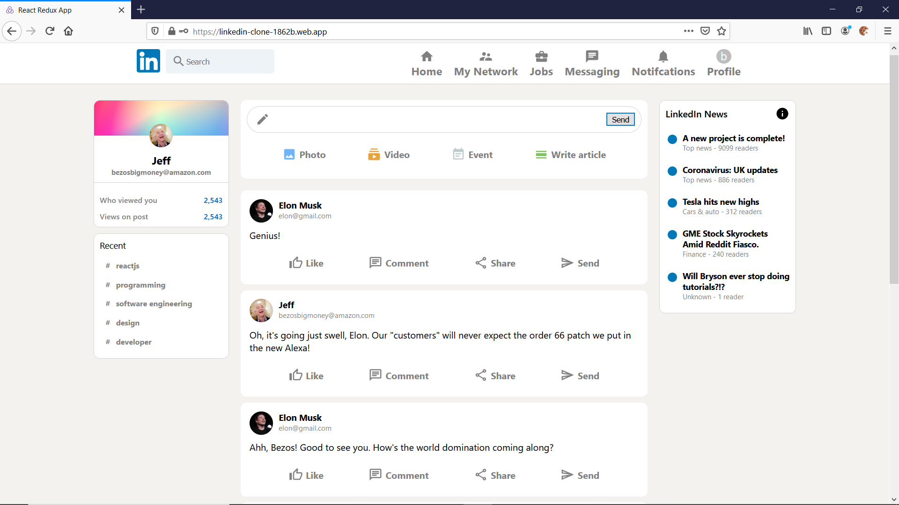

## LinkedIn Clone

### About
I made this clone as a part of a youtube tutorial I followed on React.js, Redux, and Firebase. The link to the tutorial is [here](https://www.youtube.com/watch?v=QaYts9sPmcY)

### Built With
* React.js
* Redux Toolkit (for global state)
* Firebase (for backend authentication, storage, and hosting)

### Live Link
The link is hosted on firebase and can be accessed [here.](https://linkedin-clone-1862b.web.app/)  
You can sign in with **email: elon@gmail.com** **password: elonelon**  
If you want to register your own account, fill out a name, email, and password and click on Register (not the sign in button).  
To log out click on the profile on the upper right.  

